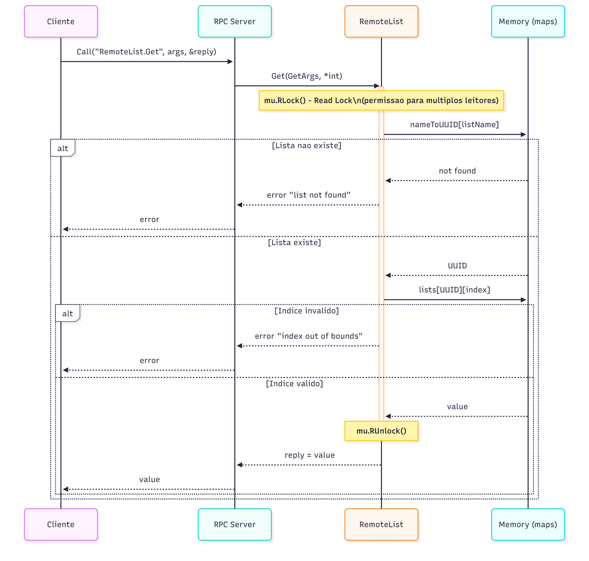
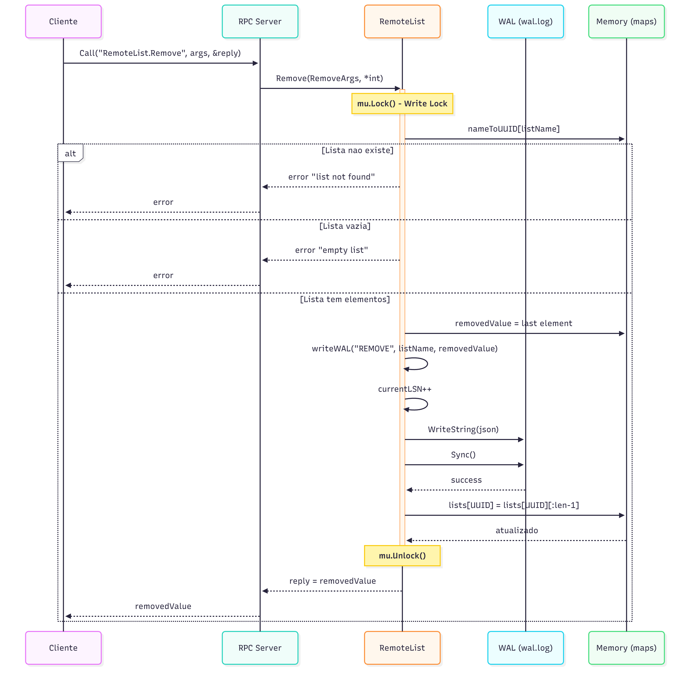
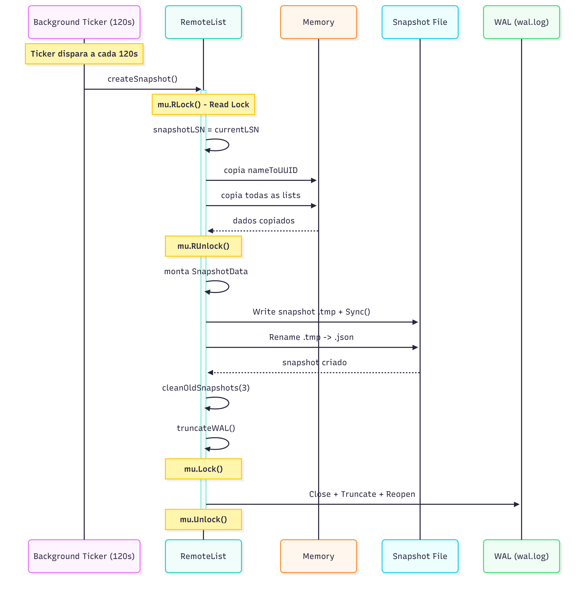
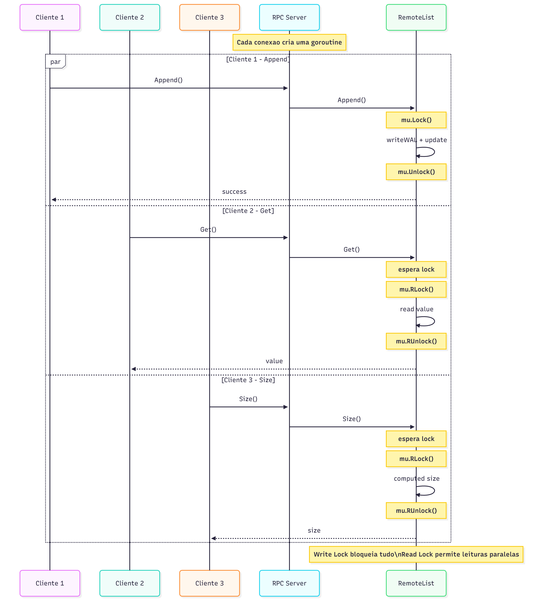

# RemoteList RPC - Sistema de Listas Distribuídas

Sistema cliente-servidor que implementa listas remotas compartilhadas usando RPC (Remote Procedure Call) em Go, com persistência durável e acesso concorrente.

## Características Principais

- **RPC sobre TCP**: Comunicação cliente-servidor usando `net/rpc` do Go
- **Múltiplos Clientes**: Suporte a acesso concorrente com exclusão mútua
- **Persistência Híbrida**: WAL (Write-Ahead Log) + Snapshots periódicos
- **Recuperação Automática**: Restaura estado após falhas
- **Thread-Safe**: Sincronização com `sync.RWMutex`

## Operações Disponíveis

| Operação | Descrição | Tipo |
|----------|-----------|------|
| `Append(list_name, value)` | Adiciona valor ao final da lista | Escrita |
| `Get(list_name, index)` | Retorna valor em posição específica | Leitura |
| `Remove(list_name)` | Remove e retorna último elemento | Escrita |
| `Size(list_name)` | Retorna tamanho da lista | Leitura |
| `ListAll()` | Lista todas as listas existentes | Leitura |

## Arquitetura do Sistema

O sistema utiliza:
- **Mapeamento Híbrido**: Nomes (strings) → UUIDs internos
- **Memória Principal**: `map[uuid.UUID][]int` para dados
- **Persistência em Disco**: WAL + Snapshots a cada 120s
- **Locks**: RWMutex permite leituras paralelas e escritas exclusivas

> ## Documentação Teórica de RPC

Para uma explicação detalhada sobre os *conceitos* de RPC (Remote Procedure Call), Client Stub, Server Stub, marshaling/unmarshaling e o fluxo completo de uma chamada remota implementada neste sistema, consulte o documento [`doc/rpc-explicacao.md`](./remotelist/doc/rpc-explicacao.md).

## Diagramas de Sequência

### Operação GET (Leitura)



Operações de leitura (`Get`, `Size`, `ListAll`):
- Usam `RLock` (Read Lock)
- Permitem múltiplas leituras simultâneas
- Não bloqueiam outras leituras, apenas escritas
- Retornam dados diretamente da memória

### Operação REMOVE (Escrita)



Operações de escrita (`Append`, `Remove`):
1. Adquire `Lock` exclusivo
2. Grava operação no WAL (com `fsync`)
3. Atualiza estado em memória
4. Libera lock
5. Retorna resposta ao cliente

### Snapshot Background Task



Processo automático a cada 120 segundos:
1. Usa `RLock` para copiar dados da memória
2. Cria arquivo snapshot temporário (.tmp)
3. Grava JSON e sincroniza com disco
4. Renomeia para arquivo final (operação atômica)
5. Remove snapshots antigos (mantém 3)
6. Trunca o WAL (operações já estão no snapshot)

### Modelo de Concorrência



**Estratégia de Locks:**
- **Write Lock** (`mu.Lock`): Bloqueia todas as operações (leitura e escrita)
- **Read Lock** (`mu.RLock`): Permite múltiplas leituras simultâneas, bloqueia apenas escritas

**Goroutines:**
- **Main**: Servidor RPC + handlers de requisições (uma goroutine por cliente)
- **Background**: Timer de 120s que cria snapshots automáticos

## Persistência e Recuperação

### Write-Ahead Log (WAL)
```
{"lsn":1,"timestamp":1699564800,"operation":"APPEND","list_name":"compras","value":10}
{"lsn":2,"timestamp":1699564801,"operation":"REMOVE","list_name":"compras","value":10}
```
*Formato: JSON Lines (JSONL) - cada linha é um objeto JSON independente*

### Snapshot
```json
{
  "lsn": 50,
  "timestamp": 1699565000,
  "lists": {
    "compras": [10, 20, 30],
    "tarefas": [100, 200]
  }
}
```

### Limpeza Automatica de Arquivos

O sistema implementa gerenciamento automatico de arquivos de persistencia para controlar uso de disco:

#### Truncamento de WAL
- **Quando**: Apos cada snapshot bem-sucedido (a cada 120 segundos)
- **Como**: O arquivo WAL e truncado (resetado para vazio)
- **Seguranca**: Todas as operacoes ate o LSN do snapshot ja estao persistidas
- **Tamanho maximo**: Com snapshot a cada 120s, o WAL nunca cresce alem de ~120s de operacoes

#### Rotacao de Snapshots
- **Formato de nome**: `snapshot_<timestamp>.json` (ex: `snapshot_1699564800.json`)
- **Retencao**: Mantem apenas os 3 snapshots mais recentes
- **Limpeza**: Automatica apos cada novo snapshot
- **Espaco**: Limitado a ~3x o tamanho de um snapshot
- **Recovery**: Sempre usa o snapshot mais recente disponivel

**Exemplo de ciclo completo:**
```
1. Snapshot criado: snapshot_1699564800.json (LSN=100)
2. WAL truncado (agora vazio)
3. Novas operacoes LSN=101, 102, 103... gravadas no WAL
4. 120s depois: snapshot_1699564920.json criado (LSN=150)
5. WAL truncado novamente
6. Processo se repete...
7. Ao atingir 4 snapshots, o mais antigo e removido automaticamente
```

**Estrutura de arquivos no diretorio data/:**
```
data/
├── wal.log                    (sempre pequeno, <1MB)
├── snapshot_1699564770.json   (penultimo)
├── snapshot_1699564800.json   (antepenultimo)
└── snapshot_1699564830.json   (mais recente, usado no recovery)
```

### Algoritmo de Recovery
```
1. Carregar snapshot.json (se existir) → estado base + LSN
2. Ler wal.log e aplicar apenas entradas com LSN > snapshot LSN
3. Sistema pronto com estado consistente
```

## Como Usar

### Pré-requisitos
- Go 1.21.5+

### Executar Servidor
```bash
cd remotelist
go run pkg_server/remotelist_rpc_server.go
```

### Executar Cliente
```bash
cd remotelist
go run pkg_client/remotelist_rpc_client.go
```

### Compilar
```bash
# Servidor
go build -o server.exe pkg_server/remotelist_rpc_server.go

# Cliente
go build -o client.exe pkg_client/remotelist_rpc_client.go
```

## Estrutura do Projeto

```
mini_projeto_RPC/
├── remotelist/
│   ├── pkg_structs/
│   │   └── remotelist_rpc.go       # Structs e lógica principal
│   ├── pkg_server/
│   │   └── remotelist_rpc_server.go # Servidor RPC
│   ├── pkg_client/
│   │   └── remotelist_rpc_client.go # Cliente com testes
│   ├── doc/                         # Diagramas de sequência
│   │   ├── get-sequence.png
│   │   ├── remove-sequence.png
│   │   ├── background-sequence.png
│   │   └── concorrencia-sequence.png
│   └── data/                        # Gerado em runtime
│       ├── wal.log
│       ├── snapshot_<timestamp>.json (3 arquivos mantidos)
│       └── snapshot_<timestamp>.json.tmp (temporario durante criacao)
```

## Escalabilidade, Disponibilidade e Consistência

### Características do Sistema

**Consistência:** Forte - todas as leituras retornam a última escrita confirmada. WAL com `fsync` garante durabilidade e locks garantem isolamento.

**Disponibilidade:** Limitada - servidor único é ponto de falha. Recuperação automática via WAL + Snapshot após reinício.

**Escalabilidade:** Leituras concorrentes (RLock), escritas serializadas ~100-200 ops/s (fsync por operação), dados limitados pela RAM.

### Limitações

1. Servidor único sem redundância (ponto único de falha)
2. Escritas síncronas (~5-10ms por fsync)
3. Armazenamento limitado pela RAM disponível
4. Sem distribuição de dados entre servidores

### Pontos de Falha e Recuperação

**Falha do Servidor:** Sistema indisponível, recuperação automática ao reiniciar (WAL + Snapshot), sem perda de dados confirmados.

**Falha de Disco:** Perda total de dados, sem replicação implementada.

**Falha Durante Snapshot:** WAL cresce indefinidamente, sistema continua operando mas disco pode encher.

**Falha de Rede:** Clientes desconectam, reconexão automática quando rede retorna.

**Crescimento de Dados:** RAM insuficiente trava servidor, requer intervenção manual.

### Mecanismos de Tolerância a Falhas

**Implementado:** WAL com durabilidade por operação, snapshot periódico (120s), recuperação automática (`estado = snapshot + WAL`), locks para race conditions, rename atômico de snapshots.

**Não Implementado:** Replicação, troca automática de servidor em caso de falha (failover), monitoramento de saúde, backups.

### Melhorias de Escalabilidade

**1. Replicação com algoritmo de consenso (Raft/Paxos):** Usar 3 ou mais servidores onde um líder coordena as escritas e garante que a maioria dos servidores tenha os dados antes de confirmar. Mantém consistência forte, tolera falha de até metade dos servidores, permite múltiplas leituras simultâneas. Trade-off: escritas ficam 2-3x mais lentas (precisa esperar confirmação da maioria).

**2. Particionamento de dados (Sharding):** Dividir as listas entre múltiplos servidores usando hash do nome da lista para determinar onde cada uma fica armazenada. Multiplica capacidade de escrita e armazenamento pelo número de servidores. Trade-off: se um servidor falha, perde-se acesso a uma parte dos dados; operações que envolvem múltiplas listas em servidores diferentes ficam complexas.

**3. Escrita Assíncrona:** Agrupar várias escritas antes de gravar no disco (batch fsync a cada 10-50ms) e usar cache para leituras. Alcança 1000-10000 escritas por segundo. Trade-off: em caso de falha pode perder operações dos últimos 10-50ms; leituras podem não ver a escrita mais recente imediatamente.

**4. Consistência Eventual (CRDT):** Permitir que múltiplos servidores aceitem escritas ao mesmo tempo e sincronizem depois. Máxima disponibilidade e velocidade. Trade-off: diferentes servidores podem ter dados diferentes temporariamente (segundos ou minutos); precisa de lógica para resolver conflitos quando dados divergem.

**Recomendação:** Replicação com consenso (Raft) é a melhor opção pois mantém a garantia de consistência forte, permite que o sistema continue funcionando mesmo com falhas e melhora a velocidade de leitura. O custo de escritas mais lentas é aceitável para sistemas que precisam de garantias fortes.

## Tecnologias

- **Linguagem**: Go 1.21.5
- **RPC**: `net/rpc` (biblioteca padrão)
- **Persistência**: JSON (WAL e Snapshots)
- **Sincronização**: `sync.RWMutex`
- **Identificação**: UUIDs v4 (`github.com/google/uuid`)

## Licença

Este projeto está sob a licença especificada no arquivo [LICENSE](LICENSE).
